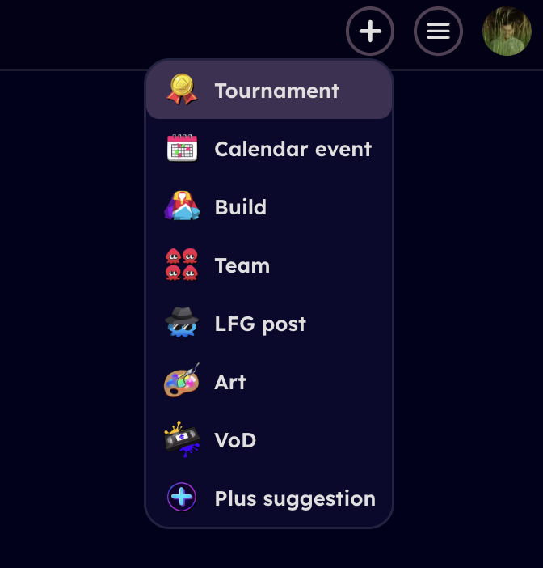
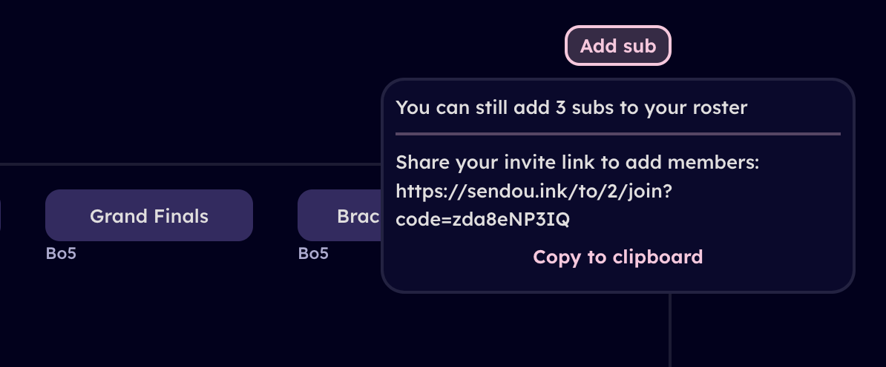
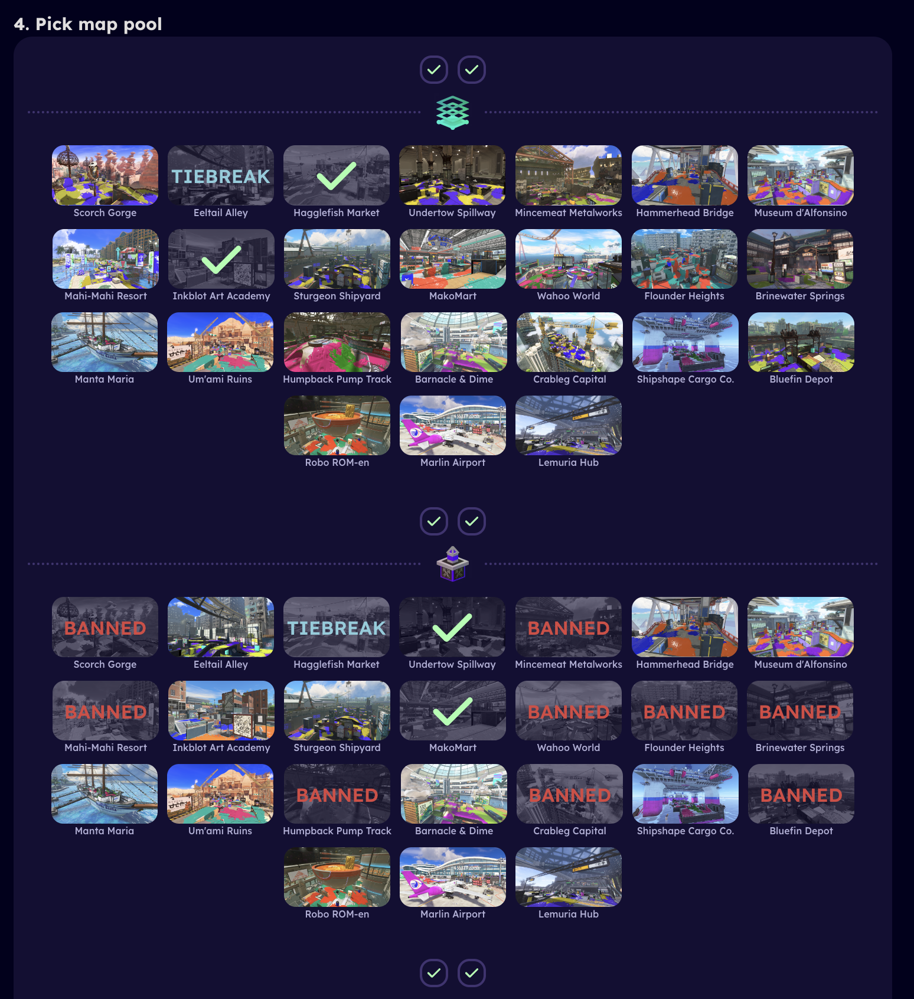
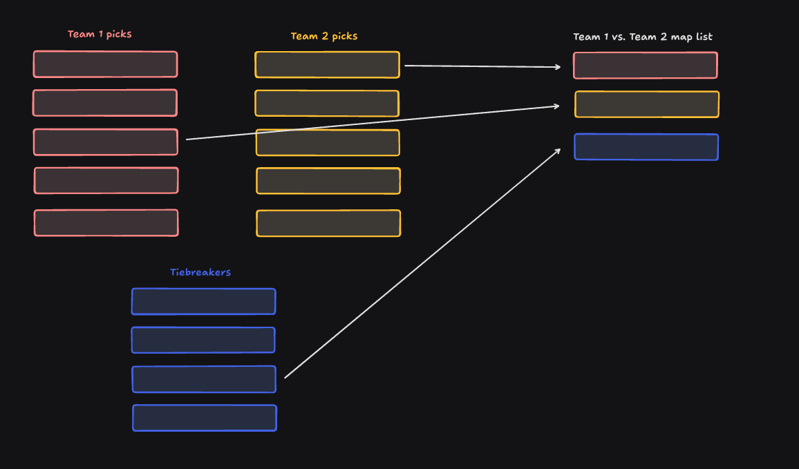
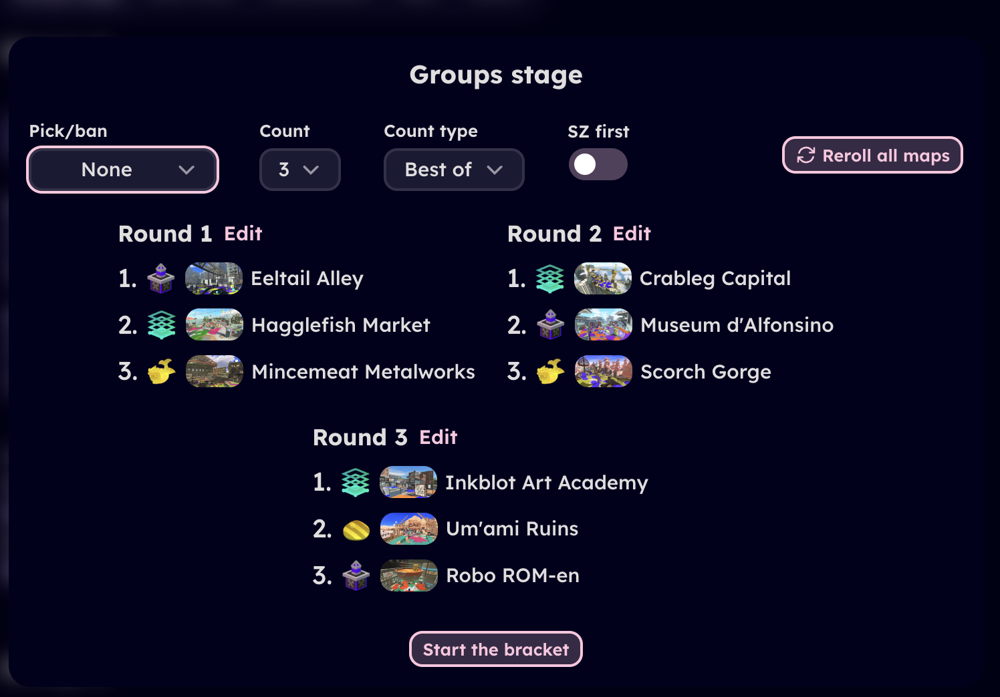
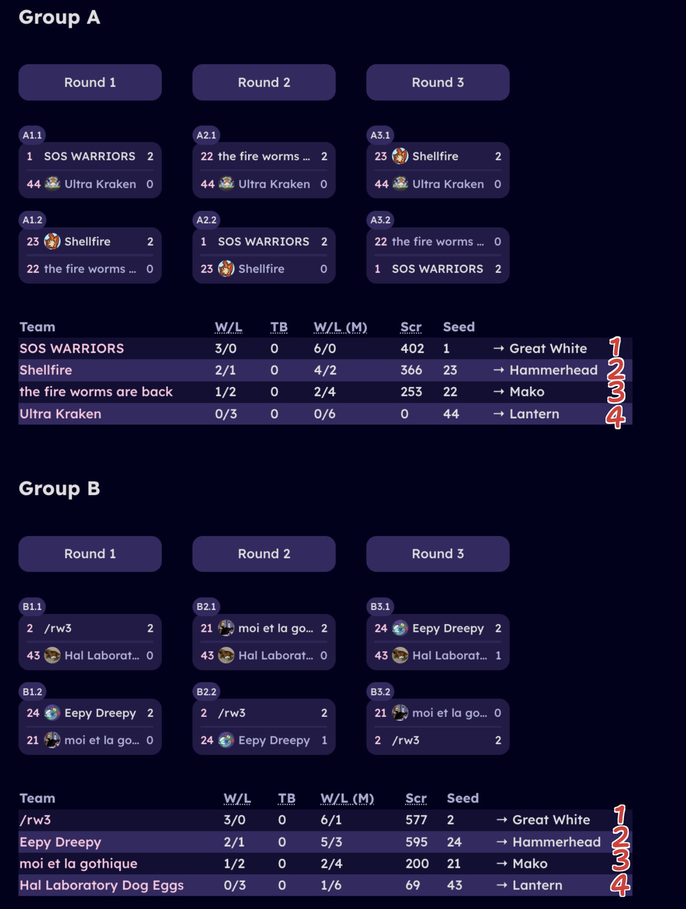

# Creating a tournament

## About

Sendou.ink can used to run Splatoon 3 tournaments without the need of another bracket hosting website. Currently it is in limited beta. You can request access via our Discord if you are an established tournament organizer.

## Creating

Tournaments can be created via the add menu on the top right of your screen after logging in assuming you have access:

## Fields

This section explains all the different options when you are creating a tournament and what they do.

### Name

Name of the tournament.

### Description

Description of the tournament, shown when registering. Supports Markdown including embedding images.

### Rules

Rules of the tournament. Supports Markdown including embedding images.

### Dates

When tournament starts. Note that unlike calendar events, tournaments can only have one actual starting time.

### Discord server invite URL

Invite link URL to your tournament's Discord server.

### Tags

Tags that apply to your tournament. Please take a look at the selection and choose all that apply.

### Logo

Tournament logo you can upload to be shown in various places.

### Players count

Choose whether you want to host a regular 4v4 tournmament or 3v3/2v2/1v1 tournament.

### Registration closes at

Choose relative to the tournament start time when sign ups close. When the registration closes new teams can't sign up, add team members, change their registration info and new users can't join the list of subs. Everything but the last is possible via admin actions regardless of whether the registration is open or not.

### Ranked

Host the event as ranked or not. If there is a ranked season open on the site then ranked tournaments contribute to the seasonal rankings. Some events are not allowed to be run as ranked:

- Gimmick rules (some weapon restrictions is fine for example "no duplicate specials")
- 3v3/2v2/1v1
- Skill capped in any way

If you are not sure whether your event qualifies to be ran as ranked, ask before hosting.

### Autonomous subs

Allow teams to add subs while the tournament is in progress on their own. If off then all the subs have to be added by the tournament organizers.

*Tournament team member adding a sub in the middle of a tournament*

### Require in-game names

Especially for tournaments where verification is important. Players need to have submit an in-game name (e.g. Sendou#1234) and this can't be changed after registration closes.

### Invitational

All teams added by the tournament organizer manually. No open registration or subs list. In addition for invitational teams can add only 5 members before the tournament starts on their own (and 6 during it if autonomous subs are enabled).

### Strict deadlines

Display the "deadline" for each round as 5 minutes stricter. Note that this is only visual and it's up to the tournament organizer how to enforce these if at all.

## Tournament maps

With sendou.ink tournaments all maps are decided ahead of time.

### Prepicked by teams

Map pool is always the same as current SendouQ seasonal map pool in terms of bans.

For SZ/TC/RM/CB only no maps are picked by the tournament organizer.

For all modes the tournament organizer picks one tiebreaker map per mode.

*Team picking maps as part of their registration process*

Then when the tournament in in progress an algorithm decides the map list for each match:

[More info on how it works](https://gist.github.com/Sendouc/285c697ad98171243bf5c08a4c7e1f30).

### Picked by TO

Note that here you select just the map pool. The actual map lists are picked when the bracket starts (or prepared) in advance:

*View when starting bracket*

## Tournament format

Choose the tournament format. You can have at most 10 brackets with teams advancing between them as you wish.

Source bracket means a bracket where teams come from. Target bracket means a bracket where teams go to after first playing some other bracket. A bracket can be both at the same time.

### Is follow-up bracket

If toggled off, teams join from the sign-up. Turns this bracket into a source bracket. You can set which teams start from which bracket in the seeding page. Note that when this option is enabled you are creating a tournament where teams that start in separate brackets will not meet (so in essence they are separate tournaments but just happening on the same tournament page).

### Placements

Placements is a comma separated list of placements. So e.g. the following are valid:

- `1,2,3`
- `1-3`
- `-1,-2`

Placements are relative in the sense that the amount of teams that sign up don't affect them. `1` is always the 1st placement but `2` is the "2nd best possible placement to achieve" and so on. So for example with round robin the amount of teams advancing from that bracket depends entirely on the amount of groups (which is decided via sign ups.)

*A screenshot from one Swim or Sink and how the placements map*

### Start time

Whether to start the bracket right after the previous one concludes or at some other time. This can be useful for two day tournaments. Note that it's not really meant to organize an event that spans many weeks (organization page features can be used instead).

### Check-in required

Whether to require check-in to the bracket or not. Note even if you leave it off, you can still check out teams.

### Limitations

Current limitations. Feel free to leave feedback if it's blocking you from running some event you wish:

- Single-elimination can not be a source bracket
- Double-elimination can only be a source bracket when it comes to people who drop in the losers round (negative placements)
- Only one source bracket per target bracket.

